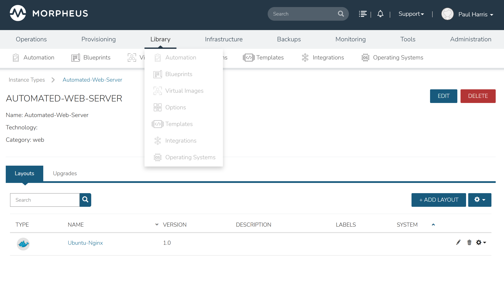
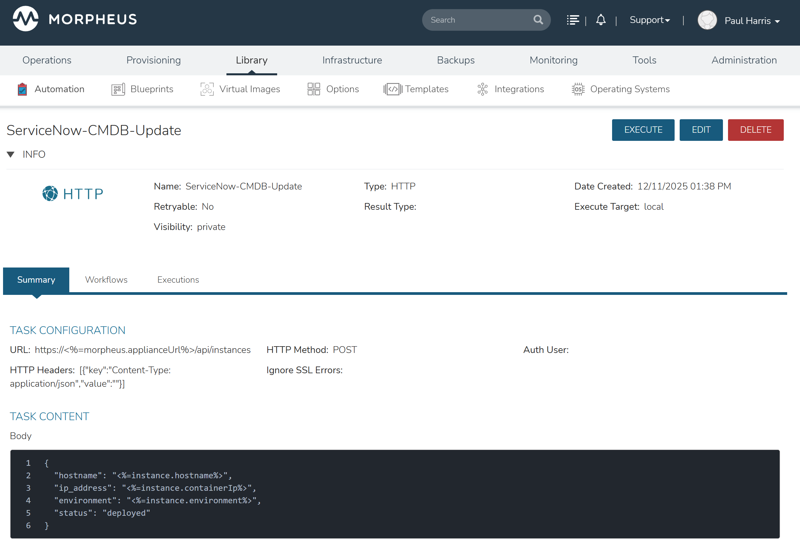
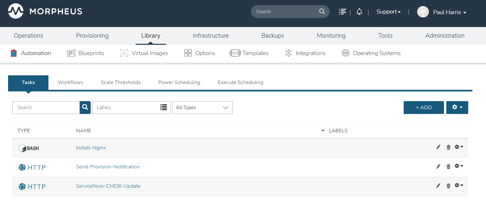
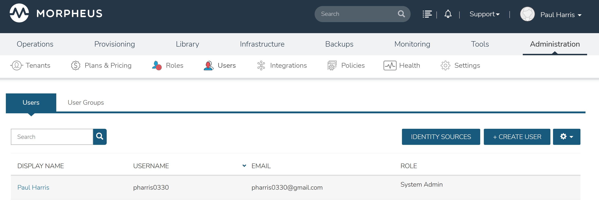
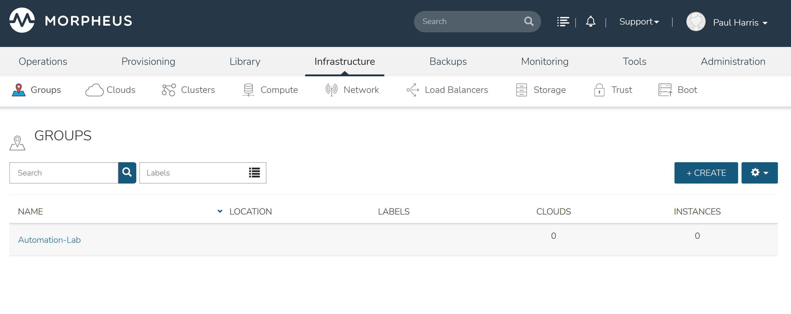

# Morpheus CMP Automation Lab

[](https://github.com/YOUR_USERNAME/morpheus-cmp-lab/actions/workflows/infrastructure.yml)

A comprehensive infrastructure automation lab demonstrating enterprise-grade Cloud Management Platform (CMP) integration, Infrastructure as Code (IaC), and DevOps workflows using **HPE Morpheus Enterprise**.

---

## Executive Summary

This lab demonstrates end-to-end automation capabilities for hybrid cloud infrastructure management. Using Morpheus Community Edition, I successfully:

- **Integrated AWS Cloud** and resolved IAM provisioning issues
- **Provisioned EC2 instances** through Morpheus CMP
- **Built automation workflows** with script and REST tasks
- **Created CI/CD pipelines** with security scanning
- **Developed ServiceNow CMDB integration** for ITSM workflows

> "Using Morpheus Community Edition, I integrated AWS, resolved IAM provisioning failures, built automation tasks and workflows, and successfully provisioned EC2 instances through Morpheus while documenting CE limitations that prevent agent-based lifecycle automation."

---

## Architecture Overview
```
┌─────────────────────────────────────────────────────────────────────────┐
│                        GitHub Actions CI/CD                              │
│  ┌───────────┐  ┌───────────┐  ┌───────────┐  ┌───────────────────────┐ │
│  │ Validate  │→ │ Security  │→ │   Plan    │→ │ Approve → Apply       │ │
│  │ TF + Ans  │  │ TFSec     │  │ TF Plan   │  │ Manual Gate           │ │
│  └───────────┘  └───────────┘  └───────────┘  └───────────────────────┘ │
└─────────────────────────────────────────────────────────────────────────┘
                                    │
                                    ▼
┌─────────────────────────────────────────────────────────────────────────┐
│                      HPE Morpheus Enterprise CMP                         │
│  ┌─────────────┐  ┌─────────────┐  ┌─────────────┐  ┌─────────────┐    │
│  │   Clouds    │  │   Groups    │  │   Tasks     │  │  Workflows  │    │
│  │   AWS-Lab   │  │ Automation  │  │ Nginx/REST  │  │ Provisioning│    │
│  └─────────────┘  └─────────────┘  └─────────────┘  └─────────────┘    │
└─────────────────────────────────────────────────────────────────────────┘
         │                                              │
         ▼                                              ▼
┌─────────────────┐  ┌─────────────────┐  ┌─────────────────────────────┐
│    AWS EC2      │  │   ServiceNow    │  │    Ansible Configuration   │
│  Ubuntu 20.04   │  │   CMDB Sync     │  │    Nginx + Security        │
└─────────────────┘  └─────────────────┘  └─────────────────────────────┘
```

---

## Morpheus Lab Screenshots

### Dashboard


### AWS EC2 Instance Provisioning




### Automation Tasks






### Provisioning Workflow


### Instance Types & Blueprints


### RBAC & Governance








### CI/CD Pipeline


---

## Lab Accomplishments

### ☁️ Cloud Integration (AWS)

| Component | Status | Details |
|-----------|--------|---------|
| AWS Cloud Added | ✅ Complete | `AWS-Lab` integrated with Morpheus |
| Group Created | ✅ Complete | `Automation-Lab` for resource scoping |
| EC2 Sync | ✅ Complete | Instance types, networks, subnets, security groups |
| IAM Permissions | ✅ Resolved | Fixed `DescribeInstanceTypes` and `RunInstances` |
| EC2 Provisioning | ✅ Success | Ubuntu 20.04 instance deployed |

### ⚙️ Automation Components

| Component | Name | Purpose |
|-----------|------|---------|
| Script Task | `Install-Nginx` | Installs Nginx, writes marker file to `/tmp/morpheus_lab.txt` |
| REST Task | `Send-Provision-Notification` | Sends JSON webhook for ITSM integration |
| Workflow | `Provisioning-Automation-Workflow` | Chains tasks for lifecycle automation |

### 🖥️ Instance Provisioning

Successfully provisioned AWS EC2 instances through Morpheus:

- **Instance Type:** Ubuntu 20.04
- **Cloud:** AWS-Lab
- **Group:** Automation-Lab
- **Verification:** EC2 instance created, IPs assigned, compute details populated

### 🔐 RBAC & Governance

Configured role-based access control demonstrating enterprise governance:

- User roles and permissions
- Group-based resource access
- Feature access controls
- Instance type access restrictions

---

## Repository Structure
```
morpheus-cmp-lab/
├── .github/
│   └── workflows/
│       ├── infrastructure.yml    # Main CI/CD pipeline
│       ├── deploy.yml            # Deployment with approval gates
│       └── pr-check.yml          # Pull request validation
├── terraform/
│   ├── modules/
│   │   └── vmware-vm/            # Reusable VM provisioning module
│   │       ├── main.tf
│   │       ├── variables.tf
│   │       └── outputs.tf
│   └── environments/
│       ├── dev/                  # Development environment
│       │   ├── main.tf
│       │   ├── variables.tf
│       │   ├── terraform.tfvars
│       │   ├── backend.tf
│       │   └── outputs.tf
│       └── prod/                 # Production environment
│           ├── main.tf
│           ├── variables.tf
│           ├── terraform.tfvars
│           ├── backend.tf
│           └── outputs.tf
├── ansible/
│   ├── ansible.cfg
│   ├── roles/
│   │   ├── base-config/          # Base system configuration
│   │   │   ├── tasks/main.yml
│   │   │   ├── handlers/main.yml
│   │   │   ├── defaults/main.yml
│   │   │   └── templates/
│   │   │       ├── sshd_config.j2
│   │   │       └── motd.j2
│   │   └── web-server/           # Nginx with security hardening
│   │       ├── tasks/main.yml
│   │       ├── handlers/main.yml
│   │       ├── defaults/main.yml
│   │       └── templates/
│   │           ├── nginx.conf.j2
│   │           ├── default-site.conf.j2
│   │           └── index.html.j2
│   └── playbooks/
│       ├── site.yml
│       └── inventory.example
├── scripts/
│   └── servicenow_cmdb_sync.py   # CMDB validation script
└── docs/
    └── screenshots/              # Lab documentation (17 images)
```

---

## CI/CD Pipeline

Multi-stage pipeline with security scanning and approval gates:

| Stage | Jobs | Status |
|-------|------|--------|
| **Validate** | Terraform validate (dev & prod), Ansible lint | ✅ Passing |
| **Security** | TFSec, Checkov, Secrets scan, SAST | ✅ Passing |
| **Plan** | Terraform plan (dev & prod) | ✅ Passing |
| **Approve** | Manual approval gate | ✅ Configured |
| **Apply** | Terraform apply, Ansible configure | ✅ Ready |

### Security Scanning Tools
- **TFSec** - Terraform security scanner
- **Checkov** - Infrastructure policy compliance
- **TruffleHog** - Secrets detection
- **Bandit** - Python SAST scanning

---

## Terraform Modules

### VMware VM Module

Reusable module for VM provisioning on vSphere:
```hcl
module "web_server" {
  source = "../../modules/vmware-vm"

  vm_name            = "${var.environment}-web-01"
  cpu_count          = var.vm_cpu_count
  memory_mb          = var.vm_memory_mb
  disk_size_gb       = var.vm_disk_size_gb
  environment        = var.environment

  vsphere_datacenter = var.vsphere_datacenter
  vsphere_cluster    = var.vsphere_cluster
  vsphere_datastore  = var.vsphere_datastore
  vsphere_network    = var.vsphere_network
  vsphere_template   = var.vsphere_template

  tags = {
    Environment = var.environment
    Project     = "morpheus-lab"
    ManagedBy   = "Terraform"
  }
}
```

**Features:**
- Configurable CPU, memory, disk sizing
- Template-based cloning
- Environment tagging
- Multi-environment support (dev/prod)
- Separate state management per environment

---

## Ansible Roles

### Base Configuration Role

- System package installation (vim, curl, git, htop, etc.)
- SSH hardening (key-only auth, root login disabled, max auth tries)
- NTP/Chrony time synchronization
- User and group management
- Security baseline configuration
- MOTD with system information

### Web Server Role

- Nginx installation and configuration
- SSL/TLS support with self-signed certificates
- Security headers (X-Frame-Options, X-Content-Type-Options, etc.)
- Health check endpoints (`/health`)
- Firewall configuration (UFW)
- Server tokens disabled (version hiding)
```yaml
- name: Configure web servers
  hosts: webservers
  become: yes
  roles:
    - role: base-config
    - role: web-server
      vars:
        web_server_type: nginx
        enable_ssl: true
```

---

## ServiceNow Integration

Python script for CMDB validation and incident management:
```bash
# Demo mode - simulates API responses
python scripts/servicenow_cmdb_sync.py \
  --vm-name dev-web-01 \
  --environment dev \
  --demo

# With expected values validation
python scripts/servicenow_cmdb_sync.py \
  --vm-name dev-web-01 \
  --environment dev \
  --expected-cpu 2 \
  --expected-memory 4096 \
  --demo

# JSON output for CI/CD integration
python scripts/servicenow_cmdb_sync.py \
  --vm-name dev-web-01 \
  --environment dev \
  --demo --json
```

**Features:**
- CMDB record lookup and validation
- Automated incident creation on sync failures
- Configurable validation rules with severity levels
- Retry logic with exponential backoff
- JSON output for CI/CD integration

---

## Troubleshooting Performed

Demonstrated real-world diagnostic capabilities:

### IAM Permission Issues
- Identified missing `DescribeInstanceTypes` and `RunInstances` permissions
- Used AWS CLI to reproduce and verify fixes
- Successfully resolved for EC2 provisioning

### Networking
- Analyzed SSH failures caused by missing key pairs
- Verified security groups, VPC, and subnet configurations

### Morpheus CE Limitations
Documented platform constraints:
- Community Edition provisioning workflow limitations
- Agent installation differences from Enterprise
- Instance lifecycle state management
- "Operation not allowed" state issues

> This troubleshooting experience demonstrates the diagnostic skills needed for production CMP environments.

---

## Skills Demonstrated

| Skill | Implementation |
|-------|----------------|
| Cloud Management Platform | Morpheus installation, configuration, AWS integration |
| Infrastructure as Code | Terraform modules with dev/prod environments |
| Configuration Management | Ansible roles with Jinja2 templates |
| CI/CD Pipelines | GitHub Actions multi-stage with security scanning |
| ITSM Integration | ServiceNow CMDB validation and incident creation |
| Cloud Platforms | AWS EC2 provisioning, IAM troubleshooting |
| Security Automation | TFSec, Checkov, SSH hardening, SAST scanning |
| Python Scripting | REST API integration with error handling |
| RBAC/Governance | Role-based access control, group policies |
| DevOps Practices | GitOps, automated testing, approval gates |

---

## Getting Started

### Prerequisites

- Terraform >= 1.6.0
- Ansible >= 2.15
- Python >= 3.10
- HPE Morpheus Enterprise (Community Edition or higher)
- AWS Account (for cloud integration)

### Quick Start
```bash
# Clone repository
git clone https://github.com/YOUR_USERNAME/morpheus-cmp-lab.git
cd morpheus-cmp-lab

# Validate Terraform
cd terraform/environments/dev
terraform init -backend=false
terraform validate

# Check Ansible syntax
cd ../../../ansible
ansible-playbook --syntax-check playbooks/site.yml

# Test ServiceNow script
cd ../scripts
python servicenow_cmdb_sync.py --vm-name test-vm --environment dev --demo
```

---


## Author

Paul Harris - CMP Automation Engineer Candidate

---

## License

This project is for demonstration purposes.
